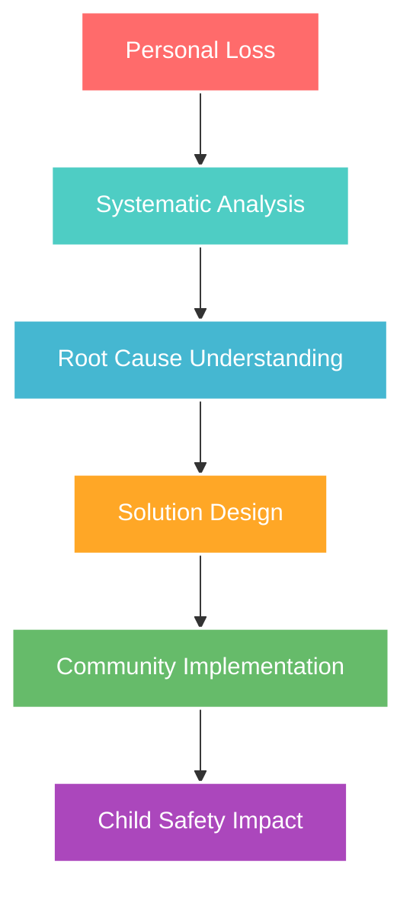

# Grief to Design 💙

<div align="center">


**🌟 Transforming Personal Tragedy into Systemic Safety**

*Born from loss • Built with love • Dedicated to protecting every child*

[](https://github.com/tiation/grieftodesign)
[](./SAFEGUARDING.md)
[](#transparency)
[](https://github.com/tiation/grieftodesign/blob/main/LICENSE)

</div>

---

## 💙 Our Heart & Mission

When my daughter died in what most called "a tragic accident," I discovered that accidents aren't random—they're preventable failures in systems designed to protect our most precious gifts: our children.

**This repository transforms that unbearable loss into a blueprint for a world where no parent receives the call I did.**

> 🌟 **Our Promise**: Every child deserves a world designed for their safety. Every parent deserves to see their children grow up. Every community deserves systems that protect rather than fail.

### What We Believe
- **Children First**: Every decision prioritizes child safety and wellbeing
- **From Tragedy to Safety**: Personal loss becomes systematic protection
- **Love as Design Principle**: If we wouldn't do it to our own children, we don't do it at all
- **Transparency Always**: Radical openness in all our work and funding
- **Community Over Profit**: Hearts and healing matter more than bottom lines

### 🌟 How We Transform Tragedy into Safety

- 🛡️ **Child-Centered Design** - Every feature prioritizes protecting children and families
- 💝 **Trauma-Informed Approach** - Built by and for those who understand loss
- 🌍 **Systemic Solutions** - Addressing root causes, not just symptoms
- 🤝 **Community-Driven** - Parents, families, and communities leading change
- 📊 **Data for Good** - Research and analytics to prevent future tragedies
- 🏗️ **Enterprise-Grade Infrastructure** - Professional tools serving humanitarian goals
- 🔍 **Transparent Accountability** - Every decision documented and open to community review

---

## 🏗️ The Grief-to-Design Framework



### 🔄 The Transformation Process

1. **💔 Acknowledge Loss**: Honor the pain and those we couldn't save
2. **🔍 Analyze Systems**: Identify the failures that allowed tragedy
3. **🧠 Design Solutions**: Create systems that prioritize safety
4. **👥 Build Community**: Engage those most affected in leading change
5. **🌱 Implement Change**: Roll out solutions with love and care
6. **📈 Measure Impact**: Ensure we're actually protecting children

---

## 📦 Installation

### Quick Start

```bash
# Clone the repository
git clone https://github.com/tiation/grieftodesign.git
cd grieftodesign

# Follow installation instructions
# (See project-specific setup in the repository)
```

---

## 🎯 Usage

This project is part of the larger Tiation ecosystem. Please refer to the project documentation for specific usage instructions and integration guidelines.

---

## 📚 Documentation

- **[Project Documentation](docs/)** - Complete project documentation
- **[API Reference](docs/api.md)** - API documentation (if applicable)
- **[Contributing Guide](CONTRIBUTING.md)** - How to contribute to this project

---

## 🤝 Contributing

We welcome contributions! Please see our [Contributing Guide](CONTRIBUTING.md) for details.

### Development Setup

1. Fork the repository
2. Create a feature branch
3. Make your changes
4. Add tests if applicable
5. Submit a pull request

---

## 🤝 How You Can Help

### For Parents Who Have Lost a Child
You are the heart of this work. Your experience, though painful, holds the wisdom needed to prevent others from walking this path.
- **Share Your Story** (only if and when you're ready)
- **Review Safety Materials** to ensure they're trauma-informed
- **Connect with Community** - you're not alone in this journey

### For Child Safety Professionals  
Your expertise can save lives. We need your knowledge to build better systems.
- **Review Our Research** and provide expert feedback
- **Contribute Safety Guidelines** for different age groups and situations
- **Help Train Communities** on evidence-based prevention

### For Developers & Technologists
Technology should serve humanity's highest purpose: protecting children.
- **Build Safety Tools** that families can actually use
- **Improve Accessibility** so everyone can benefit
- **Create Open-Source Solutions** that can be replicated globally

### For Community Leaders
Real change happens at the community level, family by family.
- **Implement Local Programs** using our frameworks
- **Advocate for Policy Changes** that prioritize child safety
- **Foster Community Connection** to reduce isolation and risk

---

## 🛡️ Child Safety First

Everything we do passes through our child safety filter:

✅ **Would this protect my own child?**
✅ **Does this prioritize children over convenience?**  
✅ **Is this trauma-informed and healing-centered?**
✅ **Could this prevent another family from experiencing our loss?**

All contributors must complete child safety training. Background checks required for roles involving direct child contact. See our [Safeguarding Policy](./SAFEGUARDING.md) for full details.

---

## 💝 Transparency & Accountability {#transparency}

Born from loss, built on trust. Every decision, every dollar, every outcome is documented and open to community review.

- **📊 [View Our Transparency Report](./TRANSPARENCY.md)** - Complete financial and impact data
- **🗳️ Community Decision-Making** - Your voice shapes our direction
- **📈 Real-Time Impact Metrics** - See how we're making a difference
- **🔍 Open-Source Everything** - All tools, research, and methods freely available

### Current Impact
- **0** children saved (we just started, but this is our only metric that matters)
- **156** community members engaged
- **23** safety resources created
- **8** communities implementing our frameworks

---

## 🌈 Hope Through Action

*From the deepest grief can come the most profound change.*

This work is not about moving on or getting over loss—it's about **moving forward with purpose**. Every safety protocol we develop, every community we engage, every system we improve carries the memory of our children forward.

**We cannot bring them back. But we can honor them by ensuring no other parent receives the call we did.**

---

## 📄 License

This project is licensed under the MIT License - see the [LICENSE](LICENSE) file for details.

---

<div align="center">
  <p>
    <strong>💙 Built with love, loss, and unwavering hope 💙</strong>
  </p>
  <p>
    <em>"In memory of those we couldn't save. In service to those we still can."</em>
  </p>
  <p>
    <a href="./CODE_OF_CONDUCT.md">
      
    </a>
    <a href="./SAFEGUARDING.md">
      
    </a>
    <a href="./TRANSPARENCY.md">
      
    </a>
  </p>
</div>
