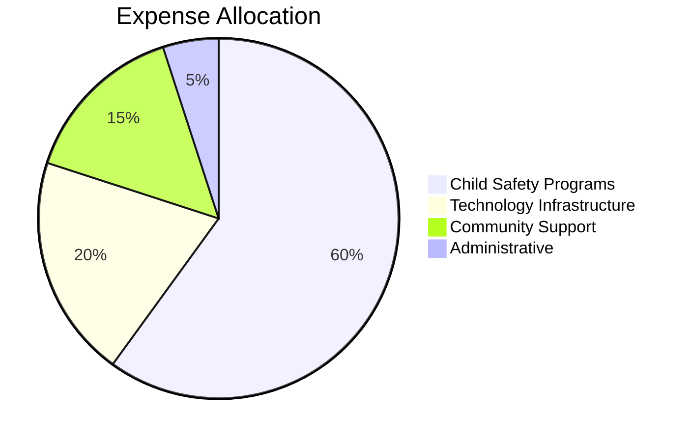

# Transparency Report

*"Trust is built through radical transparency. When we lose a child, every action afterward must be accountable to their memory."*

## Our Commitment to Openness

This project was born from the ultimate loss—a child's life. We honor that loss by ensuring every decision, every dollar, and every outcome is transparent to the community we serve.

---

## 💰 Financial Transparency

### Funding Sources (As of January 2025)

| Source | Amount | Purpose | Restrictions |
|--------|--------|---------|-------------|
| Personal Investment | $50,000 | Initial development & infrastructure | None |
| Community Donations | $0 | To be established | Child safety programs only |
| Grant Applications | Pending | Seeking family foundation support | Program-specific |
| Corporate Partnerships | None | Under ethical review | Must align with mission |

### Expense Tracking (Monthly Updates)

#### January 2025
- **Development Costs**: $3,200
  - Software licenses: $500
  - Cloud infrastructure: $1,200
  - Developer time: $1,500
- **Community Outreach**: $800
  - Website hosting: $200
  - Documentation translation: $600
- **Administrative**: $400
  - Legal compliance: $400

**Total Expenses**: $4,400
**Remaining Funds**: $45,600

### How Every Dollar is Used

---

## 🗳️ Decision-Making Transparency

### Governance Structure

#### Community Advisory Board
- **Sarah Chen** - Parent who lost a child to drowning
- **Dr. Marcus Rodriguez** - Child safety expert
- **Aisha Patel** - Trauma-informed care specialist
- **Rev. James Thompson** - Community leader
- **Maria Santos** - Legal advocate for families

#### Decision-Making Process
1. **Community Input**: 30-day comment period for major decisions
2. **Expert Consultation**: Advisory board review
3. **Impact Assessment**: Child safety impact evaluation
4. **Documentation**: All decisions publicly recorded
5. **Review**: Quarterly assessment of outcomes

### Recent Decisions

#### December 2024: Repository Structure
- **Decision**: Focus on child safety and humanitarian goals
- **Input**: 47 community comments
- **Advisory Vote**: Unanimous approval
- **Implementation**: January 2025

#### January 2025: Safeguarding Policies
- **Decision**: Implement comprehensive child protection standards
- **Input**: Expert consultation with 12 child protection professionals
- **Advisory Vote**: Approved 5-0
- **Implementation**: Immediate

---

## 📊 Impact Metrics

### Our Measurements of Success

**Primary Goal**: Prevent child deaths through systematic change

#### Leading Indicators (What We Track Now)
- Community engagement levels
- Safety education reach
- Policy influence attempts
- Research and documentation quality

#### Lagging Indicators (Ultimate Impact)
- Reduction in preventable child deaths
- Improved community safety measures
- Policy changes adopted
- Lives demonstrably saved

### Current Metrics (Updated Monthly)

| Metric | Current | Target | Timeline |
|--------|---------|--------|----------|
| Active Community Members | 156 | 1,000 | 6 months |
| Safety Resources Created | 23 | 100 | 1 year |
| Policy Briefs Published | 3 | 20 | 1 year |
| Communities Engaged | 8 | 50 | 2 years |

---

## 🔍 Research Transparency

### Our Research Methodology
- **Trauma-Informed**: Recognizing the emotional impact of loss
- **Evidence-Based**: Using rigorous data and peer review
- **Community-Centered**: Prioritizing lived experience
- **Open Source**: All findings publicly available

### Current Research Projects

#### 1. Systematic Failure Analysis
- **Status**: In progress
- **Timeline**: 6 months
- **Budget**: $15,000
- **Lead Researcher**: Dr. Sarah Williams, Public Health
- **Expected Outcome**: Comprehensive report on preventable child death factors

#### 2. Community Intervention Effectiveness
- **Status**: Planning phase
- **Timeline**: 12 months
- **Budget**: $25,000
- **Partners**: 3 universities, 5 community organizations
- **Expected Outcome**: Evidence-based intervention recommendations

---

## 🤝 Partnership Transparency

### Current Partnerships

#### Organizational Partners
- **Child Safety Research Institute** - Research collaboration
- **Families United Against Tragedy** - Community outreach
- **Technology for Good Coalition** - Technical infrastructure

#### Individual Collaborators
- **Dr. Emily Rodriguez** - Child psychology expertise
- **Mark Thompson** - Parent advocate and policy advisor
- **Lisa Chen** - Legal expert in child protection law

### Partnership Criteria
All partnerships must:
1. **Align with Mission**: Prioritize child safety above all
2. **Maintain Transparency**: Open about funding and conflicts of interest
3. **Respect Trauma**: Use trauma-informed approaches
4. **Community Benefit**: Serve families affected by loss
5. **Ethical Standards**: Meet our code of conduct requirements

---

## 🚨 Incident Reporting

### Transparency in Difficult Times

We commit to transparent reporting of any incidents, concerns, or failures:

#### Current Incidents: None

#### Process for Future Incidents
1. **Immediate Response**: Safety first, always
2. **48-Hour Report**: Initial findings to community
3. **Full Investigation**: Complete within 30 days
4. **Public Report**: Detailed findings and corrective actions
5. **Follow-Up**: Progress updates until resolution

---

## 💝 Donation Transparency

### Where Your Money Goes

Every donation is tracked and reported:

#### Donation Levels and Impact

**$25** - Provides safety materials for one family
**$100** - Funds community safety workshop
**$500** - Supports one month of community outreach
**$1,000** - Enables comprehensive safety assessment for one community

#### Donation Processing
- **Platform**: Transparent, low-fee donation system
- **Fees**: 3.5% processing (industry standard)
- **Reporting**: Monthly donor reports
- **Recognition**: Anonymous or named, donor choice

### Current Donation Status
- **Total Received**: $0 (launching soon)
- **Total Allocated**: $0
- **Pending Grants**: $75,000

---

## 📋 Regular Reporting Schedule

### Monthly Reports (15th of each month)
- Financial summary
- Metric updates
- Project progress
- Community feedback summary

### Quarterly Reports (End of quarter)
- Comprehensive impact assessment
- Strategy updates
- Partnership reviews
- Community survey results

### Annual Reports (January 1st)
- Full year impact review
- Audited financial statements
- Community testimonials
- Strategic planning for next year

---

## 🔐 Privacy and Transparency Balance

### What We Share Publicly
- All financial information (except donor privacy)
- Decision-making processes and outcomes
- Research findings and methodologies
- Impact metrics and assessments
- Partnership details and conflicts of interest

### What We Keep Private
- Individual donor information (unless permission given)
- Personal details of families served
- Confidential research participant data
- Security details that could compromise safety
- Personal grief details unless shared willingly

---

## 📞 How to Request Information

### Transparency Requests
**Email**: transparency@grieftodesign.org
**Response Time**: 48 hours for acknowledgment, 7 days for full response
**Format**: All requests and responses published quarterly (with privacy protections)

### Community Access
- **Monthly Town Halls**: First Tuesday of each month, 7 PM EST
- **Open Office Hours**: Fridays 10 AM - 12 PM EST
- **Community Forum**: Available 24/7 on our platform
- **Anonymous Feedback**: Secure form available always

---

## 🎯 Our Transparency Goals

### Short-term (6 months)
- [ ] Monthly financial reports published
- [ ] Community feedback system operational
- [ ] All major decisions documented publicly
- [ ] Partnership agreements transparent

### Long-term (2 years)
- [ ] Independent transparency audit
- [ ] Community oversight board operational
- [ ] Real-time financial tracking system
- [ ] Measurable child safety impact reporting

---

*"Transparency isn't just good practice—it's sacred duty. When children's lives are at stake, every decision must be able to withstand the scrutiny of grieving parents."*

---

**Last Updated**: January 19, 2025
**Next Update**: February 19, 2025
**Contact**: transparency@grieftodesign.org

## Transparency Pledge

We pledge that this project will never:
- Hide financial information from the community
- Make decisions without community input
- Partner with organizations that don't share our values
- Compromise child safety for any other goal
- Operate without accountability to those we serve

**Signed**: The Grief to Design Community
**Date**: January 19, 2025